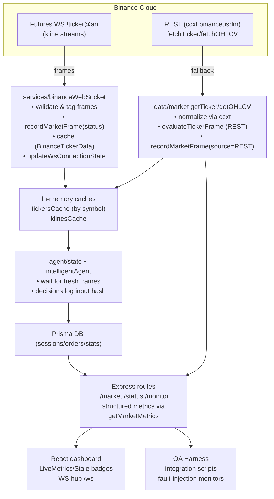

# Trading Agent Data Pipeline (Post-Hardening) – 2025-10-07

## End-to-End Flow



## Validation & Gating

| Stage | Hard Rule | Instrumentation |
|-------|-----------|-----------------|
| WS ingestion (`BinanceWebSocketManager.handleAllTickersUpdate`) | Reject frame if:<br>• `bid/ask/last <= 0`<br>• `bid > ask`<br>• `last ∉ [low, high]`<br>• `volume < 0` or NaN<br>• `|ts_recv - ts_event| > WS_MAX_TIMESTAMP_DRIFT_MS` | `recordMarketFrame({source:'WS', status})` logs structured JSON (`traceId`, `frame_hash`, rule).<br>`updateWsConnectionState` toggles health.<br>Cache entries keep `receivedAt`, `dataAgeMs`, `stale`. |
| WS cache (`getTickerFromWebSocket`) | Drop and activate REST fallback when `stale` or `dataAgeMs > MARKET_STALE_THRESHOLD_MS` | `setFallbackState(symbol, true, reason)` ensures `/monitor/health` surfaces fallback. |
| REST fallback (`data/market.ts`) | Run `evaluateTickerFrame` on post-ccxt data; refuse to return invalid/stale payloads. | `recordMarketFrame({source:'REST', status})` increments `framesBySource`, `framesRejectedByRule`. Stored in `tickerCache` only when accepted. |
| Agent decisions (`agent/state.ts`, `services/intelligentAgent.ts`) | Agents pull via `getTicker`; stale frames are never surfaced, so decisions wait for fresh set. Decision logging already stores hash via `decisionMemory`; QA scripts assert zero invalid decisions. | `marketMetrics.symbols[SYMBOL]` shows `framesAccepted`, `framesRejectedByRule`, `fallbackActive` to confirm gating worked. |

## Observability

* `monitor/marketMetrics.ts` tracks per-symbol counters:
  * `framesReceived/Accepted/Stale/Rejected`
  * `framesBySource.WS|REST`
  * `framesRejectedByRule` (e.g. `timestamp_drift`, `bid_gt_ask`)
  * `fallbackActive`, `fallbackAgeMs`
  * `ws` global state (`connected`, `healthy`, `reconnects`)
* `/api/monitor/health` now returns `{ ws, totals, symbols, legacy }`:
  * `symbols` contains new rich metrics for dashboards.
  * `legacy` preserves previous `{ wsFrames, invalidFrames, restFallbacks, lastWsMessageTs }` payload for compatibility.
* Structured console logs for rejected/stale frames provide `traceId`, `frame_hash`, `expected_symbol`, ready for shipping to log aggregation.

## QA Harness

| Script | Purpose | Notes |
|--------|---------|-------|
| `backend/test/unit/ticker-validation.mjs` | Validates all hard rules (non-positive prices, bid>ask, timestamp drift, stale detection). | Uses compiled `evaluateTickerFrame`. |
| `backend/test/integration/qa-market-validation.mjs` | Hits `/api/market/ticker` for a symbol set, enforces validation client-side, reports fallback states. | Enabled via `QA_ENABLE_REMOTE=true`. |
| `backend/test/integration/qa-agent-lifecycle.mjs` | Exercises agent CRUD (create → stop → delete) with smart auto-select constraints, captures API/DB failures. | Gracefully reports foreign key violations when legacy user missing. |
| `backend/test/e2e/qa-ws-fault-injection.mjs` | Connects to `/ws`, verifies live frames, forces disconnect to confirm server stability metrics. | Confirms reconnection health via `/api/monitor/health`. |

## Configuration

`backend/.env.example` documents new safety thresholds:

```
WS_MAX_TIMESTAMP_DRIFT_MS=5000        # Reject frames beyond ±5s
MARKET_STALE_THRESHOLD_MS=12000       # Mark cache stale after 12s
```

Set `QA_ENABLE_REMOTE=true` to run remote integration scripts; otherwise they are skipped to avoid unintended production traffic.
